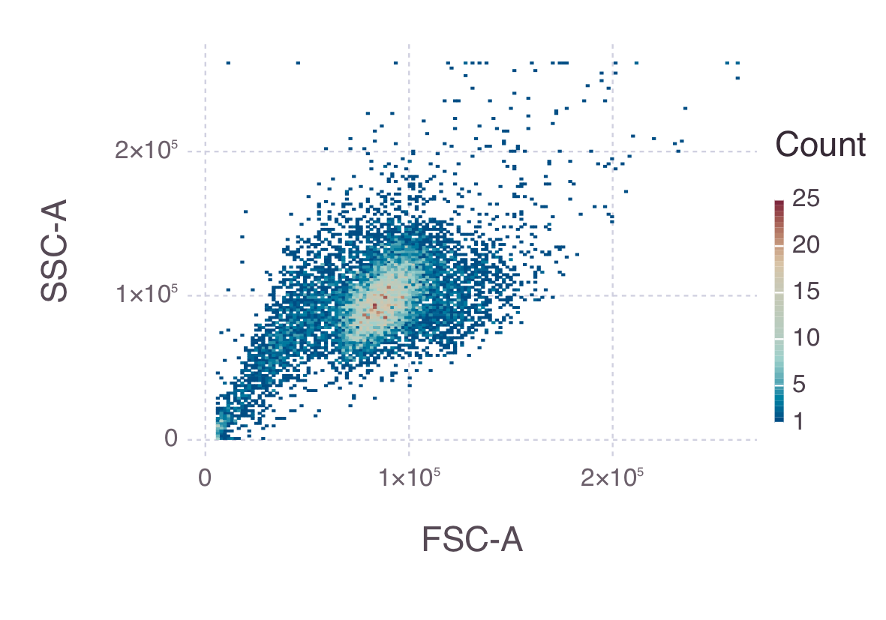

# FCS

Read Flow Cytometry Standard (FCS) files in Julia

[](https://travis-ci.org/tlnagy/FCS.jl)
[](https://coveralls.io/github/tlnagy/FCS.jl?branch=master)
[](http://codecov.io/github/tlnagy/FCS.jl?branch=master)

## Usage

```julia
julia> using FileIO

julia> using FCS

julia> flowrun = load("example.fcs")
FCS.FlowSample{Float32}
    Machine: LSRFortessa
    Begin Time: 14:12:03
    End Time: 14:12:25
    Date: 17-MAR-2017
    File: Specimen_001_Tube_002_002.fcs
    Axes:
        FSC-A
        FSC-H
        FSC-W
        SSC-A
        SSC-H
        SSC-W
        B_530-30-A
        Time

julia> using Gadfly

julia> p = plot(x=flowrun["FSC-A"], y=flowrun["SSC-A"], Geom.histogram2d,
Guide.xlabel("FSC-A"), Guide.ylabel("SSC-A"), Coord.cartesian(xmin=0, ymin=0))

julia> draw(PNG("example.png", 10cm, 7cm, dpi=300), p)

```


